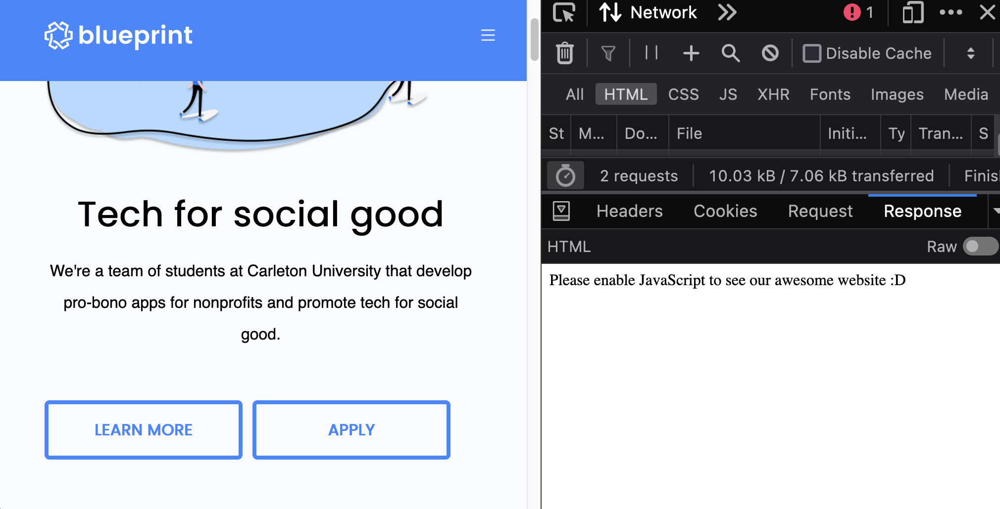
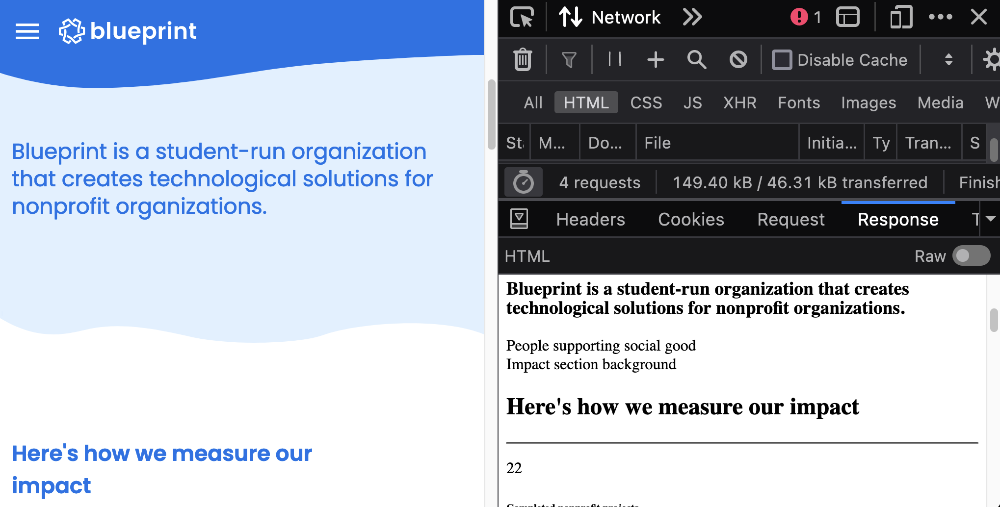

# Why Next.js

Why Next.js? Why not just use vanilla React? Or Vite? Or Gatsby? Or create-react-app?

## Alternatives

| **Alternative**  | **Pros**                                                                                                                    | **Cons**                                                                        |
| ---------------- | --------------------------------------------------------------------------------------------------------------------------- | ------------------------------------------------------------------------------- |
| vite             | Gentle to learn, close to vanilla React.                                                                                    | Limited to client-side rendering, no built-in routing mechanisms.               |
| create-react-app | Legacy tool (probably more widely adopted for having been around the longest).                                              | Vite has pretty much replaced CRA as the new standard for being more optimized. |
| gatsby           | (if you're considering using Gatsby, have you ever heard of [Next.js](https://Next.js.org/)? No? Might wanna try that out!) | Updating between gatsby versions is a whole dumpster fire.                      |

## Developer Experience

Yes, Next.js offers so many quality-of-life features that I could yap on and on about for hours – but if I had to choose one key reason for why we chose Next.js, it would be for the **Developer Experience**.

Ever had trouble dealing with **environment variables**, **file-based routing**, **absolute imports**, **import aliases**, or even just deploying your app? I know I have, and I've never had to worry about these things ever since I was introduced to the world of Next.js. This is because Next.js has all these features built-in, no third-party libraries or configurations needed.

:::tip[Did you know?]

Yes, we primarily design and build software for nonprofits.

However, we also have a strong focus on **education** and **mentorship**, and we feel a strong sense of responsibility towards our student developers. We want our developers to use and learn **only the best tools and practices** in the industry (that they can then apply and put into practical use in the real world), and Next.js is one of them.

:::

As well, the [documentation](https://nextjs.org/docs) from the Vercel team _(who made Next.js)_ is absolutely top-notch 🤩

## SEO and Performance

Next.js is also known for its **SEO** and **performance** benefits. It's a server-rendered framework, which means that your pages are **pre-rendered** on the server before being sent to the client.

It's also great for **performance** because your users get a fast-loading page right off the bat (unlike traditional React apps, which have to wait for the JavaScript to load before rendering the page on the browser). Next.js also offers some built-in optimization mechanisms such as **lazy-loading** and **image optimization** _(these are all automatic, there's nothing extra that we as developers have to do)_.

The image below shows a preview of the response from the old Carleton Blueprint website.

### carletonblueprint.org

The preview pane on the right shows a single line of text: **"Please enable JavaScript to see our awesome website :D"**.

While the `:D` is a nice touch, the message is clear: the website requires JavaScript to function. This means that search engines like Google won't be able to crawl the site properly (crawlers and bots only look at static content–they do not execute Javascript), which is bad for SEO.

As well, users with JavaScript disabled (while rare) won't be able to access the site at all. Beyond that, browsers have to wait for the JavaScript to load before rendering the page, which can slow down the user experience.

---

### uwblueprint.org

In comparison, the Waterloo Blueprint website is built with Next.js. The preview pane on the right shows a statically rendered page **already populated with content** (though styles and additional assets like images may be omitted).

This is because Next.js pre-renders the page on the server before sending it to the client. This is great for SEO because search engines can easily crawl the site and index the pages.
