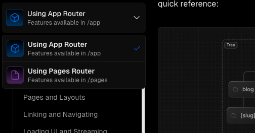

# Guides

This page lists some of the key "good-to-know" features of Next.js that are extensively used in developing Blueprint apps. As well, it provides some **Blueprint-specific guidelines** for using these features.

## Environment Variables

Read more from the official Next.js [docs](https://nextjs.org/docs/app/building-your-application/configuring/environment-variables).

:::danger[Important Notes]

- **Always** store sensitive information like API keys, passwords, and other secrets in environment variables. **Never** hardcode them in your codebase.

- **Never** commit the `.env.local` file to your repository (it should be added to `.gitignore`). This is to ensure that sensitive information like API keys, passwords, and other secrets are not exposed.

:::

1. Create a `.env.local` file in the root of your project.
2. Add environment-specific variables on new lines in the form of `NAME=value`.
3. Create a `.env.local.example` file to provide a template for developers to fill in their own environment variables.
4. Access environment variables in your code using `process.env.NAME`.

**Note**: Environment variables are loaded into `process.env` at build time on the server. They are not available in the browser for security purposes. To expose environment variables to the browser, you can use the `NEXT_PUBLIC_` prefix. Read more about `NEXT_PUBLIC_` from the official docs [here](https://nextjs.org/docs/app/building-your-application/configuring/environment-variables#bundling-environment-variables-for-the-browser).

:::tip[Blueprint Guideline]

Make sure to always include a `.env.local.example` file in your project to provide a template for developers to fill in their own environment variables.

:::

---

## File-based Routing

Next.js offers a file-based router by default (no need to install additional libraries like `react-router-dom`).

Since I already know I can't do a better job at explaning how all this works than the official Next.js docs, I'll just link you to the [**File-based Routing**](https://nextjs.org/docs/app/building-your-application/routing) section of the Next.js docs. This might also be useful: [**Next.js Project Structure (special file names)**](https://nextjs.org/docs/getting-started/project-structure).


Here are some key questions that the official docs answer:

- How do I create a new page or route?
- How do **layouts** work to create shared components like Navbars and Footers in **nested routes**?
- How do I create dynamic routes with **URL parameters** and **query parameters**? (e.g. `/projects/:id` and `/projects?category=web-dev`)
- How do I get the **current route** in my components? (e.g. `useParams`, `useSearchParams`, `useRouter`, `usePathname`)

### Blueprint-specific guides

All you need to know that might be Blueprint specific is that we use the newer **App Router** instead of the older **Pages Router** wherever we can.



- `src` folder still in use
- Colocation: `./assets`, `./components` in page folders.
- Global folders: `src/lib`, `src/components`.
- There should only be `page.tsx`, `layout.tsx`, possibly some CSS files or even 1 or 2 global components like `Footer` or `Navbar` in page folders.

---

## Import aliases

```tsx title="src/app/components/ProjectsBlock.tsx"
import Image from "next/image";
import BlockContainer from "./BlockContainer";
import image from "../assets/projectpic.png";
import LinkButton from "@/components/LinkButton";
```

- include screnshot of project dir

---

## Image Optimization

- `import Image from "next/image";`
- Styling images using Tailwind (link to Tailwind docs section)
- Image colocation (import from `./assets`)

---

## Data Fetching

- Server-side rendering
- Async components (Math.random on server and client example)

---

## `use client`

- Some libraries (e.g. typewriter-effect) makes use of `useState` and `useEffect` in their implementation which can cause issues when used on the server. If you see weird errors, consider if you're using an imported UI component that may implicitly require `use client`.

:::tip[Blueprint Guidelines]

- When using `use client`, always try to refactor out the component such that `use client` is applied to the **smallest, most low-level component** possible.
- Always **minimize the amount of code** in a `use client` component to optimize performance.

:::

```tsx title="src/pages/index.tsx" {1,3,9-15}
"use client"; // for typewriter-effect

import Typewriter from "typewriter-effect";

...

export default function HeroBlock() {
  return (
    <Typewriter
      options={{
        strings: ["Tech for social good", "Carleton Blueprint"],
        autoStart: true,
        loop: true,
      }}
    />
  );
}
```

:::tip[Did you know?]

This is only a temporary issue and will slowly be resolved as more libraries are updated to be compatible with server-side rendering.

:::

---

## API Routes

- Touch very briefly on API routes. No in-depth knowledge required. (just know this exists)
